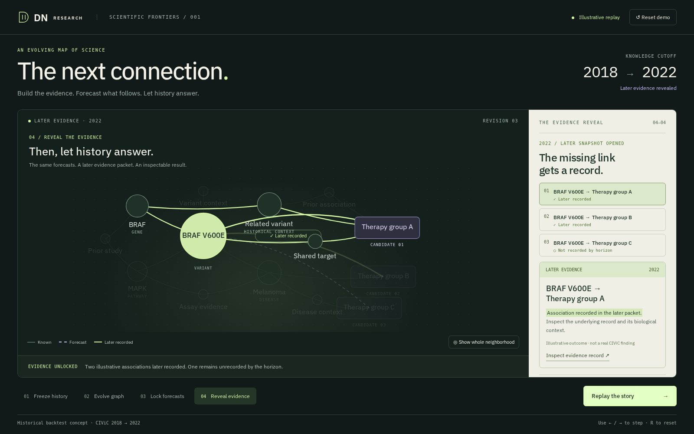

# The next connection — isolated presentation prototype



Open `index.html` directly, or from the repository root run:

```sh
python3 -m http.server 8781 --bind 127.0.0.1
```

Then visit `http://127.0.0.1:8781/design/ux-demo/`. Port 8781 is reserved for this task while its preview is running. The main application and `ian/graph-plan` preview are independent.

The prototype has no build step or runtime service dependency. IBM Plex loads from the existing frontend dependency when installed; system sans-serif is the fallback. No remote assets, API requests, model calls, source retrieval or WebGL are needed.

Click Next through the four scenes. Select any ranked candidate to focus its path. Reveal keeps the ranking fixed, shows two illustrative later-recorded outcomes and one unresolved case, and provides an evidence-detail disclosure. Use Back/Next in the stage rail, arrow keys while the page itself has focus, or R to reset. Native button keyboard activation remains available. Reset relocks the outcome scene. The fallback disclosure rehearses a service failure message while preserving the current scene; it is not a real network failover implementation.

All therapy labels, rankings, support paths and outcomes here are illustrative. BRAF/melanoma are biological context for a UI sketch, not a supported prediction. No real evidence quotations, citations, performance values or clinical conclusions are invented. The production demo should replace this content with the data owner's packet and runner/evaluator outputs.

This is an alternative composition, not a production component to import. `scene.js` is a deliberately small state machine showing the interaction; `style.css` scopes the standalone visual direction. Reuse the product's React Flow, Motion and existing controls when integrating. The proposed adapter uses existing scenario, event, forecast and outcome records; shared contract changes require coordination with the current owner.

The prototype demonstrates the reveal's visual state change. The integrated evidence panel should retain historical rationale alongside actual later excerpts, with full source context and dates. No measured comparison is shown here because none is supplied to this prototype.

See the [ranked review and demo script](../../docs/hackathon-ux-review.md) for effort estimates, integration targets, product references and a fallback for every major demo dependency.
