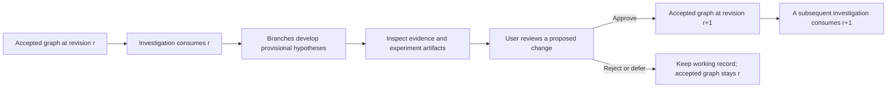

# Architecture and demo direction

This is the entry point for planning after the September 6 architecture reconciliation.
The intended product is **a scientific investigation that consumes accepted knowledge,
develops provisional branches, and asks the user before changing accepted knowledge**.
Investigations is the main work surface. Biology is the demo domain; the records and
interaction should remain useful for other hard sciences.

The earlier Forecast implementation misunderstood this boundary: it built a separate
historical replay rather than an investigation's view of scientific memory. Its rendering,
recorded experiments and evaluator remain useful assets. Its standalone destination is
not the next product direction. No application behavior changes in this documentation pass.

## Read these before taking another slice

| Document | Question it answers |
|---|---|
| [Knowledge contract](knowledge-contract.md) | Who owns knowledge, who can change it, what branches see, and where today's code differs |
| [Surfaces and next work](surfaces-and-next-work.md) | Which existing screen/component to extend, what has already landed, and the next proposed slices |
| [Code map](code-map/README.md) | A reproducible Graphify map of tracked source, with provenance and coverage limits |
| [Hosting and preview](hosting.md) | Hosting recommendation, automatic main deployment and the current public-link limitations |
| [Runtime contract](../runtime.md) | Implemented question, branch, attempt, event, replay and experiment-artifact records |
| [Evidence review](../ux-code-review.md) | Existing relationship/source inspection and its ranked UI follow-ups |

The [Board](https://github.com/richykim7/dnhacks/issues/1) remains authoritative for active
ownership. Documentation is a source-linked snapshot, not a claim that all proposed
contracts are implemented. Audit began at `37dabe4`; relevant changes were reconciled
through `e04e9ff` (Evidence, e-value work, and runtime). Recheck main and the Board before editing.

## The demo's central transition

This is the **target**, not a diagram of current persistence. Today the branch tree is
a researcher lineage view; the scientific graph is another object. Working records are
written durably in the project's database, and approval copies findings into a separate
global master. The next run still reads the working database. See the contract's actual
flow and source links before describing the master as the source of truth.

One question remains open: does the accepted graph belong to a project shared across
investigations, or to an investigation run with branches below it? The user's approval-only
boundary is explicit; this ownership scope is awaiting clarification. Use an explicit
owner in the proposed contract, and settle its type before implementing storage/API changes.

“Ephemeral” describes a branch's scientific working state, not a requirement to delete
its trace. Keep hypotheses, failed experiments and provenance inspectable without
silently making them accepted knowledge. Source assertion, verification result, human
acceptance and branch continuation are different states.

## What to demonstrate next

Complete one small loop in Investigations: select a researcher, show the exact graph
context it consumed, follow one provisional relationship to its sources and experiment,
approve a concrete graph change, then show that a later investigation reads that change.
The accepted graph must remain unchanged before approval. Rejecting the same fixture
must leave it unchanged. Those two paths make the central behavior falsifiable.

Use the existing runtime journal and selected experiment view. Reuse Evidence's exact
claim/source inspection. Reuse Forecast's stable scientific graph layout and recorded
revision presentation only after passing explicitly scoped data into them; embedding a
component that fetches the global CIViC demo would misrepresent a selected investigation.

Mocks and recorded runs remain first-class demo options. Identify their provenance and
use the same proposed transition records. Animation should explain which hypothesis,
source or approval changed the state. A second researcher tree, citation drawer, runtime
event system or graph store would duplicate existing work.

These are proposed next slices, not authorization to execute deferred backlog items.
E-value implementation remains teammate scope. Keep greedy provisional; policy research
can independently investigate stronger guarantees under an explicit objective and comparator.

## What the existing experiments support

- The CIViC packet predicts later **curation additions**, not first worldwide discovery.
  Its later labels cite older publications. [Data and date semantics](../forecasting-demo.md).
- At the same structural acquisition budget, greedy AP is 0.05169 versus uniform 0.08405.
  The evidence-coverage guarantee does not imply a forecasting advantage.
- The flat/static/evolving study attempted all 22 historical queries. Only two completed
  all conditions; one has positives for AP. Conditional scores do not establish general
  graph-memory superiority. [Study protocol](../forecasting-demo.md#all-query-study).
- A zero-retrieval modern-model control on all 683 candidates achieved AUROC 0.854 / AP
  0.233 versus structural 0.819 / 0.201. This weakens any claim that this benchmark proves
  graph value or historical anticipation. [Recorded control](../forecasting-memory-control.md).
- The policy lab obtained useful certificates and negative examples through an existing
  Set-Union Knapsack specialization. No novel theorem or scientific optimality is established.
  [Proof and comparator audit](../../tasks/research/policy-lab/report.md).

The next evaluation proposal should freeze the target, candidate cohort, information
available to each condition, cost accounting and failure treatment before execution.
For the live harness, matched branch-continuation controls test allocation quality;
historical forecasting is a separate claim. A compelling mission is helping American
scientists pursue promising frontier work sooner. Present measured results at their
actual scope rather than using that mission as evidence of an advantage.
