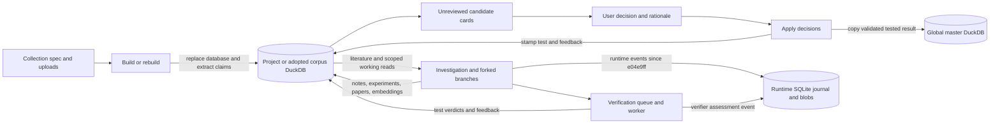
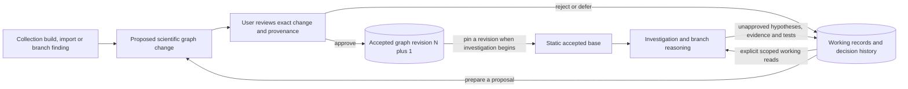

# Scientific knowledge and investigation memory contract

Status: architecture reconciliation and proposed next slice, not an implemented storage migration.
Audited code: `37dabe4`; relevant changes checked through current `e04e9ff` on 2026-09-06.

**User requirement: the permanent scientific graph changes only through user approval.**
An investigation uses that accepted knowledge as its static source of truth while branches explore.
Persisting branch traces, hypotheses, retrieved documents or verifier outputs does not make them accepted scientific knowledge.

**Unresolved ownership:** is the accepted graph owned by one run/investigation, or shared by a project across runs?
The user has not answered. This contract uses `knowledge_owner` for either choice; it does not select a default.
The existing project database and global master are implementation facts, not an answer to that product decision.

## Current implemented flow

There is no normal launch arrow from master back to the investigation. A branch's conversation is forked,
but its database is shared live rather than copied or pinned to a graph revision. The project DuckDB holds
both literature tables and unapproved working records; therefore calling that whole file an approval-only graph is inaccurate.

| Current object | Owner / scope | Read path | Write path | Approval enforced today |
|---|---|---|---|---|
| Literature claims, evidence and contexts | Project/corpus database; not keyed by run | `KGStore` structural/search reads | Build, source replacement, store methods | No individual claim approval; build starts from a user request |
| Exploration records and tested results | Same database, rows keyed by branch `run_id` | Lineage-filtered log and test reads | Agent actions and verification worker | No; they persist before review |
| Paper text and claim embeddings | Same database, shared across branches | Paper search/read; semantic retrieval | Build, network-enabled paper fetch, embedding cache fill | No; paper fetch does not extract claims |
| Conversation, traces and scratch artifacts | Branch/session, with shared raw-download cache | SDK resume; recorded replay; branch scratch | Agent execution and trace append | No; persistence supports investigation/replay |
| Runtime manifests/events since `e04e9ff` | Journal outside the corpus DB; project, investigation, branch and attempt IDs | Runtime API and replay | Launcher, agent, verifier and supervisor | No; records execution, not accepted scientific claims |
| Pending human decisions | Per-project decisions JSON; default file outside projects | Review API | Decision POST | Recognized verdict and nonempty rationale |
| Promoted tested results | One global `litmap_master_kg.duckdb` | No normal Explorer launch integration | Apply-decisions workflow | Validated decision plus rationale in the workflow; no store-level approval capability |

The launch passes the actual project/adopted DB to Explorer; the root attaches graph, log, papers and queue
to one writable connection, and children reuse those objects. See [launch][launch], [shared stores][stores],
[child construction][child] and [working/master selection][review].

## Material gaps between current behavior and the requirement

1. **No accepted revision is pinned.** `run_id` controls row visibility, not ownership of a database snapshot.
   Literature claims and papers are not lineage-scoped. Default log/test scope includes self, ancestors and
   every other investigation root without a time predicate. Thus the comment “genuinely prior runs” is stronger
   than enforcement; subsequent ancestor writes are also visible. `cross_run_memory=False` limits log/tests
   to the exact branch, but still does not isolate literature. See [read scope][scope] and [SQL predicate][lineage].
2. **A rebuild replaces the working database.** `corpus_build.build` uses `KGStore(fresh=True)`;
   `ClaimGraph` unlinks the existing file, including its exploration/test history. Ordinary source re-extraction
   removes that source's prior evidence and unsupported claims before replacement. Upload/remove changes
   attachment files and metadata; existing graph claims change on a later build. See [build write][build],
   [fresh database][fresh], [source replacement][replace] and [attachments][attachments].
3. **Autonomous writes already persist.** Notes, experiments, verifier feedback and tested results enter the
   project DB without approval. `fetch_papers` adds readable papers without claim extraction. These can be valid
   working-memory writes, but must not be described as changes to accepted knowledge. See [exploration log][log],
   [verification writeback][verify] and [paper fetch][fetch]. Adopted “read-only” protects console editing/building,
   not exploration writes to the adopted DB: [adopted records][adopted], [launch][launch].
4. **The gate validates a decision payload, not the entire acceptance boundary.** Candidate-only filtering
   happens in the review list. Applying a decision accepts any existing test ID, without rechecking candidate
   status. The lower-level promoted insert sets `human_review=validated` itself. Unknown review project IDs
   may fall back to the default working DB. No actor/approved-revision identity is attached to the decision.
   See [review API and paths][review], [decision application][apply] and [promoted insertion][insert].
5. **Promotion is not a complete scientific graph merge.** It copies a tested result and, when present,
   its linked literature claim/evidence. It does not copy `evidence_context` or `evidence_cites`; an already
   present claim does not acquire additional evidence through this helper. A result without `kg_claim_id`
   remains an `engine_tests` row, not a new structural `claim_edges` relationship. See [promoted insertion][insert].

Changes checked at `d0b864e`: Evidence now exposes collection-specific claim details, paper metadata and
contexts through a read-only endpoint, with explicit missing/unknown-source errors. Snapshot-cache filenames
now include source-path identity to separate identically named project databases. These improve inspection;
they do not establish accepted revisions, branch snapshots or a new approval boundary. See
[current claim inspection][inspection] and [current snapshot identity][snapshot].

At `e04e9ff`, launch registers the original question/project and queued state before spawning; runtime manifests,
events and blobs persist separately from the corpus DuckDB. Verifier events named `experiment.reviewed` record
verification, explicitly not human confirmation or graph promotion. Project identity is now explicit in runtime
records, but launch still passes the same writable project DB and branches still share it. The acceptance and
base-revision gaps above remain. See [runtime launch][runtime-launch], [journal][journal] and [verifier events][runtime-review].

## Intended flow and invariants

- `knowledge_owner` and `base_revision` identify the accepted base independently of branch `run_id`.
  Every branch in the investigation reads that pinned base. Later approvals create new revisions; they do
  not silently rewrite a running investigation's base. Moving an active investigation to a newer revision
  needs a separately specified action; it is outside the first slice.
- All scientific additions, removals and corrections require an approved proposal. Approval names the exact
  content/provenance reviewed, destination owner, base revision, user decision and rationale.
- Working records may persist and be replayed without approval. Branch continuation, verification success,
  model confidence, a saved file and a human-readable “validated” string cannot independently grant acceptance.
- Cached documents and derived embeddings are non-authoritative storage. They may be written without approval
  only if they cannot silently add/change accepted claims, evidence support or biological context.
- Initial collection acceptance and rebuild acceptance need an explicit product rule. A user may approve a
  complete proposed collection in one action, but merely launching extraction is not silently treated as
  approval of claims that did not yet exist. Historical source evidence remains distinguishable from new findings.

## Terms that must remain distinct

| Term in existing code | Actual meaning | Contract language |
|---|---|---|
| Branch “promotion” | Judge keeps/resumes a branch and grants further forking | Continue branch; no acceptance implied ([code][continue]) |
| Fact promotion | Copy a human-validated tested result into master | Approve a scientific graph change |
| `established` | Literature view has at least two distinct source refs | Source-count status; not user approval or proof ([code][status]) |
| `candidate` | Result survives the configured verification path | Working finding awaiting review; not established truth |
| Runtime `experiment.reviewed` | Verifier assessment event | Verification feedback; not user approval ([code][runtime-review]) |
| `validated` | Several fields use this string; agent log status is independently writable | Accepted only when backed by the approval record and accepted revision |
| Durable | Persisted across process/session boundaries | Storage lifetime; does not determine scientific authority |
| “Ephemeral branch” | Temporary reasoning scope; traces may remain durable | Branch-local working state, separate from accepted knowledge |

## Minimal next vertical slice: acceptance checks

Implementation remains proposed. Resolve accepted-graph ownership before selecting storage paths or API scope.
The smallest demonstrable slice is one accepted base, one investigation with two branches, one proposed edge
with cited context, and an approve/reject action. Reuse existing claim/evidence and review concepts where they fit.

1. Start from an identified accepted revision. Run/log/fetch/verify in both branches; the accepted scientific
   content digest and revision remain unchanged while working traces and results persist.
2. Both branches resolve the same base revision. A sibling's unapproved proposal cannot appear as accepted
   graph knowledge; any explicitly shared working result is labeled as such. Prior-run recall cannot elevate it.
3. Review shows the exact relationship, evidence, biological context and proposed change. Reject/defer saves
   the decision and leaves accepted content unchanged. Approve creates a new accepted revision exactly once.
4. Missing approval, wrong owner, unknown proposal or stale base cannot silently mutate another graph.
   Repeated application is idempotent; accepted content has a resolvable user decision and provenance trail.
5. A newly started investigation can use the approved revision according to the chosen ownership rule; the
   existing investigation retains its pinned base. Reload/replay preserves which revision supported each action.
6. Build/import/rebuild stages a proposed replacement without deleting accepted history or investigation traces.
   The demo visibly distinguishes the accepted graph, unapproved working discoveries and approval transition.

Review: documentation only. Source paths and relevant `37dabe4` → `e04e9ff` changes were inspected;
no application behavior, services or graph data were changed. This document does not claim these checks pass today.

[launch]: https://github.com/richykim7/dnhacks/blob/37dabe4d9e004a114460fa13afdbe905f1c3e4d4/src/dnhacksbio/webui/jobs.py#L129-L166
[stores]: https://github.com/richykim7/dnhacks/blob/37dabe4d9e004a114460fa13afdbe905f1c3e4d4/src/dnhacksbio/explorer/explorer.py#L335-L360
[child]: https://github.com/richykim7/dnhacks/blob/37dabe4d9e004a114460fa13afdbe905f1c3e4d4/src/dnhacksbio/explorer/explorer.py#L950-L962
[review]: https://github.com/richykim7/dnhacks/blob/37dabe4d9e004a114460fa13afdbe905f1c3e4d4/src/dnhacksbio/webui/data.py#L662-L831
[scope]: https://github.com/richykim7/dnhacks/blob/37dabe4d9e004a114460fa13afdbe905f1c3e4d4/src/dnhacksbio/explorer/explorer.py#L402-L408
[lineage]: https://github.com/richykim7/dnhacks/blob/37dabe4d9e004a114460fa13afdbe905f1c3e4d4/src/dnhacksbio/explorer/lineage.py#L74-L91
[build]: https://github.com/richykim7/dnhacks/blob/37dabe4d9e004a114460fa13afdbe905f1c3e4d4/src/dnhacksbio/litmap/corpus_build.py#L292-L330
[fresh]: https://github.com/richykim7/dnhacks/blob/37dabe4d9e004a114460fa13afdbe905f1c3e4d4/src/dnhacksbio/litmap/graph.py#L33-L40
[replace]: https://github.com/richykim7/dnhacks/blob/37dabe4d9e004a114460fa13afdbe905f1c3e4d4/src/dnhacksbio/litmap/graph.py#L121-L187
[attachments]: https://github.com/richykim7/dnhacks/blob/37dabe4d9e004a114460fa13afdbe905f1c3e4d4/src/dnhacksbio/webui/attachments.py#L58-L150
[log]: https://github.com/richykim7/dnhacks/blob/37dabe4d9e004a114460fa13afdbe905f1c3e4d4/src/dnhacksbio/explorer/exploration.py#L65-L96
[verify]: https://github.com/richykim7/dnhacks/blob/37dabe4d9e004a114460fa13afdbe905f1c3e4d4/src/dnhacksbio/explorer/verifyqueue.py#L128-L169
[fetch]: https://github.com/richykim7/dnhacks/blob/37dabe4d9e004a114460fa13afdbe905f1c3e4d4/src/dnhacksbio/explorer/explorer.py#L781-L802
[adopted]: https://github.com/richykim7/dnhacks/blob/37dabe4d9e004a114460fa13afdbe905f1c3e4d4/src/dnhacksbio/webui/projects.py#L356-L372
[apply]: https://github.com/richykim7/dnhacks/blob/37dabe4d9e004a114460fa13afdbe905f1c3e4d4/src/dnhacksbio/litmap/promote.py#L30-L77
[insert]: https://github.com/richykim7/dnhacks/blob/37dabe4d9e004a114460fa13afdbe905f1c3e4d4/src/dnhacksbio/litmap/store.py#L179-L221
[inspection]: https://github.com/richykim7/dnhacks/blob/d0b864e0dfebc6373e58556ba5b37a506cca27cd/src/dnhacksbio/webui/evidence.py#L5-L24
[snapshot]: https://github.com/richykim7/dnhacks/blob/d0b864e0dfebc6373e58556ba5b37a506cca27cd/src/dnhacksbio/webui/data.py#L104-L121
[continue]: https://github.com/richykim7/dnhacks/blob/37dabe4d9e004a114460fa13afdbe905f1c3e4d4/src/dnhacksbio/explorer/explorer.py#L1185-L1213
[status]: https://github.com/richykim7/dnhacks/blob/37dabe4d9e004a114460fa13afdbe905f1c3e4d4/src/dnhacksbio/litmap/store.py#L91-L115
[runtime-launch]: https://github.com/richykim7/dnhacks/blob/e04e9ff8bbe6a1abce23ba022518dbdde3ebb370/src/dnhacksbio/webui/jobs.py#L139-L178
[journal]: https://github.com/richykim7/dnhacks/blob/e04e9ff8bbe6a1abce23ba022518dbdde3ebb370/src/dnhacksbio/explorer/runtime.py#L65-L123
[runtime-review]: https://github.com/richykim7/dnhacks/blob/e04e9ff8bbe6a1abce23ba022518dbdde3ebb370/src/dnhacksbio/explorer/verifyqueue.py#L117-L139
