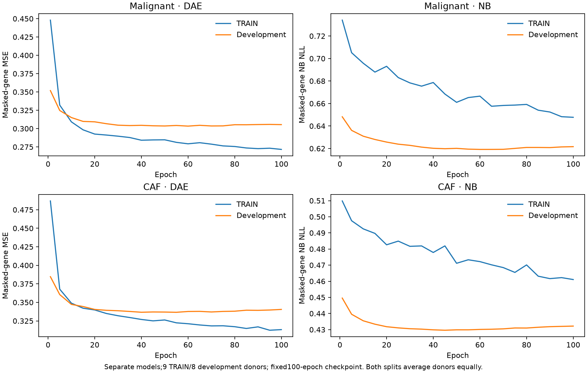
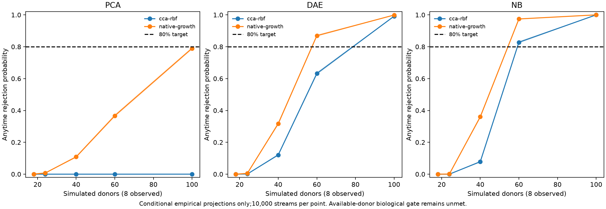

# Direct malignant/CAF GPU training

Training directly on author-CNV-supported malignant and fibroblast measurements improves conditional development power. Denoising-autoencoder (DAE) views reach 86.95% projected power at 60 simulated donors with their native-growth critic; negative-binomial (NB) views reach 82.81% with the CCA/RBF critic. **The biological power gate remains unmet:** these projections resample eight development donors, and power at the current 18-donor budget remains near zero.

## Frozen design and actual fitting

This uses the original [CUIMC acquisition and label audit](ecosystem-cna.md), preserving nine untreated TRAIN and eight untreated development donors. No donor was reassigned after numerical results. Forty-three adipocyte-labelled cells in the untreated author-CAF compartment were excluded before training this refined fibroblast measurement. All17 untreated donors retain32 cells in both compartments. Missing original H5/author-label joins remain explicitly recorded in the preceding audit; no missing gene or cell was imputed.

The malignant and CAF encoders were trained separately on CUDA with 2,625 measured genes and64-dimensional latent representations. Each DAE and NB model ran100 epochs with seed9407,15% input-gene masking, donor-balanced sampling and a fixed final checkpoint. Development losses were monitored but never used to select an epoch. NB fitting includes all-gene library offsets and training-only dispersion estimates. Validation reuses deterministic masks and averages donor losses equally. Exact covariance PCA was also fit on CUDA with equal donor weights; its unmasked reconstruction metric is not directly comparable to masked-input neural reconstruction.



| Compartment/model | Initial TRAIN loss | Final TRAIN loss | Initial development loss | Final development loss |
| --- | ---: | ---: | ---: | ---: |
| Malignant DAE | 0.4480 | 0.2716 | 0.3519 | 0.3054 |
| Malignant NB | 0.7341 | 0.6477 | 0.6482 | 0.6216 |
| CAF DAE | 0.4869 | 0.3132 | 0.3847 | 0.3405 |
| CAF NB | 0.5098 | 0.4611 | 0.4496 | 0.4322 |

DAE losses are masked-gene MSE; NB losses are masked-gene negative log likelihood. They are not interchangeable scales. Peak allocated GPU memory was1,564,509,184 bytes. Sparse inputs stay on the host; full dense model inputs are allocated only on CUDA. Each complete GPU worker holds `/tmp/dnhacks-gpu.lock`.

## Critic selection and power

Every representation uses the same deterministic32-cell mean/variance summaries. For each view,36 CCA/RBF configurations and four native-growth configurations were compared using three TRAIN-donor folds (six fit/three held out), then one configuration per family was frozen before evaluating the eight development donors. These are critic-only folds: the encoders were trained using all nine TRAIN donors. They do not constitute an independent whole-pipeline cross-validation estimate.



| View/critic | Mean TRAIN-fold growth | Development growth | Power at18 | Power at60 | Power at100 |
| --- | ---: | ---: | ---: | ---: | ---: |
| PCA / CCA-RBF | 0.1528 | 0.0144 | 0% | 0% | 0.01% |
| PCA / native | 0.1421 | 0.0936 | 0.07% | 36.70% | 78.99% |
| DAE / CCA-RBF | 0.1176 | 0.1248 | 0% | 63.20% | 99.16% |
| DAE / native | 0.1180 | 0.1495 | 0% | 86.95% | 99.90% |
| NB / CCA-RBF | 0.0513 | 0.1343 | 0% | 82.81% | 100% |
| NB / native | −0.0173 | 0.1611 | 0% | 97.44% | 100% |

The NB native critic has the highest60-donor development projection but negative TRAIN-fold growth. It is not a defensible automatic winner from training evidence. Within the NB view, CCA/RBF had better TRAIN performance. Across all views, PCA/CCA had the best TRAIN-fold growth and then transferred poorly. This selection instability must remain visible; retrospectively choosing the best development result does not establish a frozen primary design or independent confirmation.

Each point uses10,000 empirical-joint streams plus10,000 product-null streams under the unchanged native two-donor kernel, stake limit0.9 and threshold20. Reports include Monte Carlo intervals, crossing delays and noncrossers. Maximum observed product-null rejection across all six comparisons was1.29%. Conditional projections are not biological uncertainty estimates, newly acquired donors, or completion of every confounding/selection/dropout control in the plan.

The useful change is improved development sensitivity of learned representations for the actual malignant/CAF measurement. A60-donor independent usable confirmation budget has not been established. The18-donor design still fails; additional training epochs do not automatically solve that donor-budget constraint. Hwang confirmation matrices remain unopened and no private release is enabled.

## Reproduce

Prepare the untreated original specimen packs using the prior acquisition guide, then run:

```bash
PYTHONPATH=src python scripts/train_ecosystem_cna_models.py --prepared <untreated-packs> --output <models>
PYTHONPATH=src python scripts/train_ecosystem_cna_models.py --critics --prepared <models>/pca --output <pca-power>
PYTHONPATH=src python scripts/train_ecosystem_cna_models.py --critics --prepared <models>/dae --output <dae-power>
PYTHONPATH=src python scripts/train_ecosystem_cna_models.py --critics --prepared <models>/nb --output <nb-power>
```

CUDA replay of saved weights exactly reproduces all six reported held-out growth values ([replay audit](ecosystem-cna-training/replay.json)). Direct critic artifacts use only the fitter's stored normalization. `direct_critic_scores` applies it without fitting new-cohort moments. These differ from the older two-normalization artifacts described in `ecosystem-cna.md`; the older evaluator must not be used for the new weights.

Evidence: [protocol](ecosystem-cna-training/protocol.json), [encoder curves](ecosystem-cna-training/training.json), [PCA report](ecosystem-cna-training/pca-report.json), [DAE report](ecosystem-cna-training/dae-report.json), [NB report](ecosystem-cna-training/nb-report.json). Each view also retains its full candidate and selection JSON. Focused donor-fold, identity, likelihood, CUDA guard and existing source/power tests passed18/18 with two upstream SciPy deprecation warnings.
