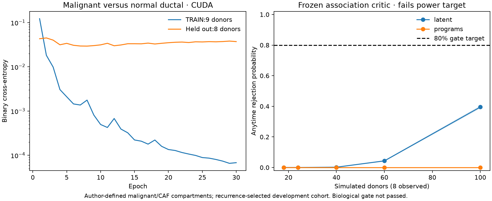

# CUIMC malignant-cell validation and power transfer

The next original donor expansion adds 21 CUIMC primary PDAC specimens from [GSE253429](https://www.ncbi.nlm.nih.gov/geo/query/acc.cgi?acc=GSE253429), including 17 untreated and four neoadjuvant-treated donors. It improves compartment annotation but **does not pass the power gate**. The existing latent association critic achieves only 39.52% conditional projected power at 100 simulated donors on eight held-out untreated donors; the predefined gene-program critic achieves 0%.



## Donors, original counts and labels

The [primary study](https://pmc.ncbi.nlm.nih.gov/articles/PMC13218419/) selected resected tumors by subsequent liver-only or lung-only recurrence. Its original CUIMC specimens are distinct in provenance from the previously used development studies; unresolved cross-source patient identity remains a confirmation exclusion. Recurrence selection means these donors are not an unselected untreated confirmation cohort. The [published clinical table](https://media.springernature.com/original/springer-static/esm/art%3A10.1038%2Fs41588-025-02345-5/MediaObjects/41588_2025_2345_MOESM3_ESM.xlsx) provides treatment status and records low-pass whole-genome sequencing in 17 donors. Author malignant annotations used inferred copy-number changes, with orthogonal genomic data where available. They are stronger reference labels than broad epithelial identity, not independent genomic proof for every nucleus.

Before opening numerical files, ascending original GSM IDs were assigned alternately to TRAIN and development-validation. This gives 11/10 donors overall and 9/8 among untreated donors. Clinical column identities, donor identifiers and matching original count filenames are checked before freezing the partition. No Hwang confirmation matrices were opened.

Acquisition retrieved 21 original filtered H5 count matrices and the published cancer, CAF and exocrine RData objects: 24 files totaling 2,603,400,761 bytes. HTTP ranges read only selected members of the public GEO ZIP; archive ranges, CRC and source SHA256 are checked. R data are parsed as data; no author code or serialized commands are executed. Only metadata slots are converted, avoiding unnecessary conversion of large expression and embedding objects.

The three author compartments contain 58,978 labels: 22,405 malignant, 17,513 CAF and 19,060 exocrine. Of these, 881 are absent from the public filtered H5 barcodes. This discrepancy is concentrated in malignant cells and can affect representation coverage; its cause has not been established. Strict preparation fails on unmatched labels. The recorded development run explicitly used `--allow-missing-author-cells`, retaining 58,097 measured cells and reporting missing counts by donor and compartment. No missing cell or gene was synthesized. All 2,625 frozen genes were measured; library offsets use all original genes, not only the selected panel.

All 17 untreated donors have at least 32 malignant and 32 CAF cells. Fixed summaries use the same deterministic 32-cell subsampling as the preceding snRNA milestone. The source's CAF compartment includes a small adipocyte-labelled subset; it remains the author-defined CAF compartment, rather than a newly claimed purified fibroblast assay.

## Real GPU training and held-out diagnostics

A fixed binary classifier distinguished author malignant labels from `ductal/ductal-like` labels among untreated donors. It used nine TRAIN donors, donor/class-balanced sampling, 30 epochs, seed 9401, and the fixed final checkpoint. Acinar, PanIN and ADM labels were not silently treated as normal ductal controls. The classifier did not replace author labels for the association test.

Actual CUDA training loss fell from 0.12246 to 0.0000682. Held-out loss was 0.04311 initially and 0.03716 at epoch 30, with a minimum of 0.02938 at epoch 8. The late increase is evidence of overfitting, not a reason to retrospectively replace the frozen final checkpoint. Across eight held-out donors (12,223 malignant/normal-ductal cells), average donor accuracy at a 0.5 threshold was 98.85%. At the 0.8 malignant-confidence threshold, donor sensitivity ranged from 90.52% to 99.95%. False-positive rates reached 9.68% in PN10 and 7.41% in PN19. Two held-out donors had no normal-ductal reference cells, so their specificity is unavailable. This is within-study donor validation, not unseen-study malignancy validation.

## Frozen association result

The preceding 44-TRAIN-donor latent and program critics were reused without refitting. Existing weights contain the fitter normalization after the initial `load_views` normalization; evaluation therefore reconstructs both stages using the original TRAIN views, never new-cohort moments. CUDA replay reproduces all five original development-study log-growth values for both critics within 1e-5 (see the [normalization replay](ecosystem-cna/normalization-replay.json)).

| Simulated donor budget | Latent projected power | Program projected power |
| --- | ---: | ---: |
| 18 | 0% | 0% |
| 24 | 0% | 0% |
| 40 | 0.21% | 0% |
| 60 | 4.33% | 0% |
| 100 | 39.52% | 0% |

The latent distinct-pair log growth was 0.06037; the program critic's was −0.19389. Each point uses 10,000 empirical-joint streams, with separate product-null streams. The 100-donor latent power interval is 38.57–40.48%, covering Monte Carlo uncertainty only. Maximum product-null rejection was 0.16% latent and 0.63% programs over these budgets. Reports retain crossing delays and noncrossers. These are conditional resampling projections from eight observed held-out donors; neither 100 new donors nor biological uncertainty is supplied by resampling.

At 18 simulated donors the latent result misses the 80% target by 80 percentage points; even at 100 it misses by 40.48 points. Improving malignant label prediction did not by itself establish a powerful cross-compartment association. Further model development must address transfer to the actual malignant/CAF measurement, while the independent usable confirmation donor budget still needs resolution. No confirmatory capability, private release or accepted biological discovery is claimed.

## Reproduction and evidence

The acquisition/preparation CLI uses `requests`, `numpy`, `scipy`, `h5py`, and optional `rdata` for extracting author metadata. Actual fitting and scoring require CUDA. Original counts remain sparse on the host; dense model inputs are allocated on CUDA under `/tmp/dnhacks-gpu.lock`.

```bash
PYTHONPATH=src python scripts/prepare_ecosystem_cna.py --acquire
PYTHONPATH=src python scripts/prepare_ecosystem_cna.py --annotations
PYTHONPATH=src python scripts/prepare_ecosystem_cna.py --prepare --allow-missing-author-cells
PYTHONPATH=src python scripts/train_ecosystem_cna.py --prepared data/interim/ecosystems/cna/prepared --output <training-output>
```

For frozen encoder evaluation, select only untreated specimen packs according to `audit/partition.json`, then run `scripts/evaluate_ecosystem_snrna.py` with the previous frozen encoder directory. Run `scripts/evaluate_ecosystem_cna.py --training-views <original-combined-fixed32-views> --new-views <new-fixed32-views> --weights <original-native-growth.npz> --output <output>` independently for latent and program views.

Artifacts include [partition](ecosystem-cna/partition.json), [source hashes](ecosystem-cna/acquisition.json), [annotation counts](ecosystem-cna/annotations.json), [preparation audit](ecosystem-cna/preparation.json), [classifier curves and donor errors](ecosystem-cna/malignancy-training.json), [frozen encoder transfer](ecosystem-cna/frozen-transfer.json), [latent power](ecosystem-cna/frozen-power-latent.json), and [program power](ecosystem-cna/frozen-power-programs.json). Forty focused tests passed, with two upstream SciPy deprecation warnings. Tests cover source-role freezing, original-count/label joins and missingness, full-library offsets, unmeasured-gene rejection, CUDA guards, frozen-normalization independence and the existing native kernel.
