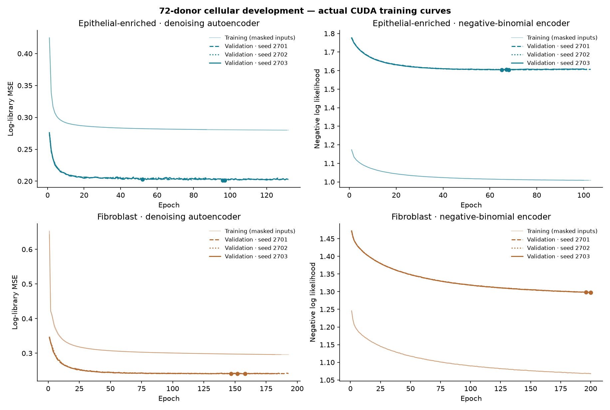
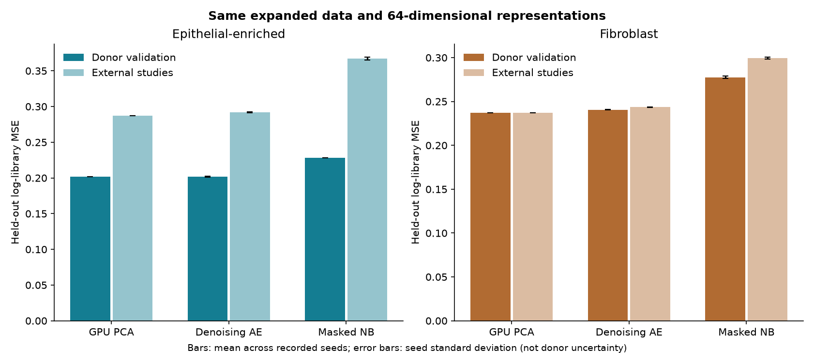
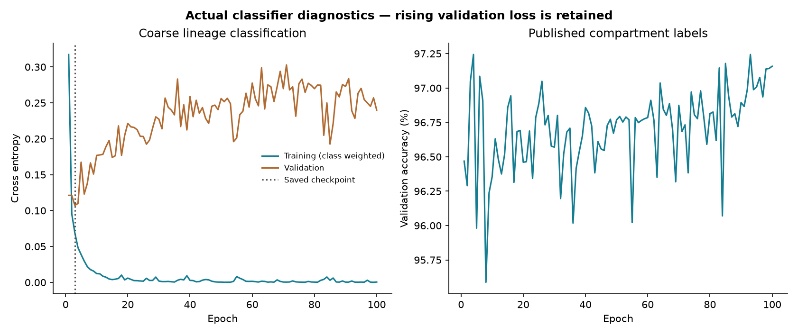
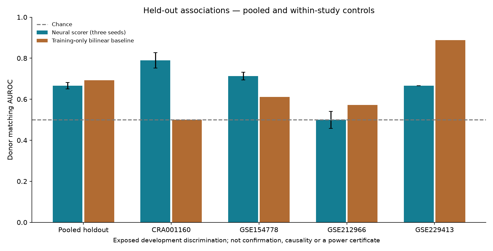

# Expanded cellular ecosystem GPU training

The September 6 development expansion increased the original Peng/Lin pool from
**34 to 72 donor records** and prepared **338,900 cells**. We completed real L40S
training of separate epithelial/fibroblast denoising and negative-binomial
encoders across three seeds, plus a coarse lineage classifier and donor-matching
scorers. Training converged; denoising validation MSE fell about 27–31% from its
first epoch. Exact GPU PCA remains the stronger external reconstruction baseline.



[Raw metrics and every recorded epoch](ecosystem-expansion/metrics.json),
[PDF curves](ecosystem-expansion/training-curves.pdf), and
[download URLs, sizes and SHA256s](ecosystem-expansion/acquisition.json) accompany
this report. Original counts and model weights stay in local ignored data storage.
These are exposed development results, not an accepted biological discovery.

## More donors, with original studies kept distinct

| Original study | Donors | Prepared cells | Assignment |
|---|---:|---:|---|
| Peng, CRA001160 | 24 | 41,986 | 16 train / 8 validation |
| [Werba, GSE205013](https://www.ncbi.nlm.nih.gov/geo/query/acc.cgi?acc=GSE205013) | 17 | 208,155 | Train |
| [Steele reprocessed, GSE229413](https://www.ncbi.nlm.nih.gov/geo/query/acc.cgi?acc=GSE229413) | 15 | 42,754 | 12 train / 3 validation |
| Lin, GSE154778 | 10 | 7,931 | Whole external study |
| [Zhang, GSE212966](https://www.ncbi.nlm.nih.gov/geo/query/acc.cgi?acc=GSE212966) | 6 | 38,074 | Whole external study |
| **Total** | **72** | **338,900** | **45 train / 11 validation / 16 external** |

We downloaded 84 new original count files, approximately 1.62 GiB, rather than a
combined atlas. Werba liver metastases, adjacent normals, and the Steele Keller
repeat were excluded. Steele's GSE229413 re-release and original GSE155698 are one
cohort. Thirteen Steele annotation joins matched original barcodes and total UMI
counts; two unmatched libraries retain their explicit GEO donor identities and
receive predicted coarse labels instead of a forced annotation join. Treatment
mixtures are included in development. The narrower untreated confirmation
population has not been silently expanded. Reserved Hwang data remain unopened.

The 2,625-gene common panel intersects measured feature names with the previous
Peng-training panels and predefined lineage markers. No external numerical
expression is used to choose genes. GPU loading caps each donor at 16,384 cells
with seed 2701, leaving **313,518 cells**. CPU preparation stays sparse; full dense
training tensors, PCA, classifiers, encoders and scorers run on CUDA.

The new epithelial compartment includes published type-1 and type-2 ductal cells;
it is broader than the first pilot's malignant-enriched proxy. Its panel and cell
selection also differ. Compare methods within this report, not old versus new MSE.

## What trained successfully

The final three-seed run took **299 seconds** on an NVIDIA L40S using Torch
2.10.0+cu128, with **10.8 GB peak allocated GPU memory**. A preceding one-seed pilot
and subsequent exact-PCA refresh were additional GPU work. Both neural encoders
use a 64-dimensional representation, 256-wide hidden layers and 15% masking.
They train for up to 200 epochs with 35-epoch validation patience; all three seeds
(2701, 2702, 2703) are reported. Checkpoints minimize validation loss. NB uses
original counts, full-library offsets, learned dispersion and a residual gene bin.

| Compartment / model | Validation log-library MSE | External log-library MSE |
|---|---:|---:|
| Epithelial exact PCA | 0.20197 | **0.28736** |
| Epithelial denoising AE, seed mean | **0.20177** | 0.29187 |
| Epithelial masked NB, seed mean | 0.22797 | 0.36698 |
| Fibroblast exact PCA | **0.23725** | **0.23721** |
| Fibroblast denoising AE, seed mean | 0.24069 | 0.24350 |
| Fibroblast masked NB, seed mean | 0.27747 | 0.29949 |



The denoising curves improve substantially during fitting, but external MSE is
about 1.6% worse than PCA for epithelial cells and 2.7% worse for fibroblasts.
NB optimizes count likelihood, not log-library MSE; its loss also falls, but it
does not win this common reconstruction comparison. We retain **PCA as the
preferred reconstruction baseline**. Metrics are cell-weighted; plotted seed
standard deviations describe fitting variability, not uncertainty across donors.

The coarse classifier's saved epoch-3 checkpoint reaches **97.0% validation
accuracy** and **77.9% external Lin accuracy** on available published labels.
Unknown labels are accepted only at confidence ≥0.8. The external drop matters
for transferring labels to the new cohorts; this is not verified malignancy.
Training continued to 100 epochs and the rising validation cross entropy is
preserved in the plot. Training cross entropy uses class weights; validation does
not, so their absolute levels are not directly comparable.



## Donor matching and the power question

**55 donors** have at least 32 accepted cells in each compartment: 35 train and
20 held out. Separate mean/variance summaries of the first-seed denoising
representations feed three independently initialized critics. Training mismatches
come from the same study as their matched donor. Pooled held-out AUROC is
**0.647, 0.683 and 0.669**, versus **0.692** for a training-only bilinear baseline.
The 20 matched and 380 mismatched combinations still represent only 20 independent
held-out donors. Critic training AUROC is nearly 1.0, indicating overfitting.

| Held-out study | Complete donors | Neural AUROC across seeds | Bilinear AUROC |
|---|---:|---:|---:|
| Peng | 5 | 0.740–0.830 | 0.500 |
| Lin | 6 | 0.689–0.733 | 0.611 |
| Zhang | 6 | 0.456–0.556 | 0.572 |
| Steele | 3 | 0.667 | 0.889 |



There is useful exploratory discrimination in Peng and Lin, but the new Zhang
study is near chance. The initial pooled-negative pilot's 0.726 AUROC is not the
final controlled result. Pooled study effects and treatment differences can still
contribute; neither scorer establishes biological coupling or causality.

Coverage is 62 complete donors at 16 cells per compartment, 55 at 32, 44 at 64 and
34 at 128. Lowering the cell requirement increases donor coverage while making
each representation noisier. The reported matching experiment keeps its original
32-cell definition; the 16-cell count is a separate sensitivity check.

The earlier 18-donor synthetic power failure was severe: 0.67% rejection for one
specified nonlinear alternative and matching fixed critic. The same synthetic
setup reached 90.03% at 60 donors. Those are scenario-specific simulation results,
not forecasts for these public data. This expansion successfully addresses the
development-data shortage and produces real trained models and curves; it does
**not yet demonstrate that the biological confirmation power gate passes**.

## Reproduce

Install `ecosystem` and `evalue` extras with a CUDA-compatible Torch build. First
prepare the original Peng/Lin inputs following the [initial report](ecosystem-training.md).
The new acquisition command freezes source selection before numerical preparation.

```sh
PYTHONPATH=src python scripts/build_ecosystem_expansion.py \
  --root data/interim/ecosystems --action acquire
PYTHONPATH=src python scripts/build_ecosystem_expansion.py \
  --root data/interim/ecosystems --action prepare

# Run on the GPU host after transferring the sparse prepared packs and code.
PYTHONPATH=src python scripts/train_ecosystem_cuda.py \
  --prepared data/interim/ecosystems/expansion/prepared \
  --output data/interim/ecosystems/expansion/results-three-seed \
  --epochs 200 --seeds 2701,2702,2703

PYTHONPATH=src python scripts/plot_ecosystem_expansion.py \
  --report data/interim/ecosystems/expansion/results-three-seed/report.json \
  --output docs/ecosystem-expansion
```

Training acquires `/tmp/dnhacks-gpu.lock` for the complete run and fails if CUDA is
unavailable. Current code uses exact CUDA covariance eigendecomposition for PCA;
the recorded run refreshed an initial randomized PCA afterward, preserving those
earlier metrics separately. `--refresh-pca` checks input hashes before refreshing
only that baseline and computing donor-coverage sensitivity. No neural model is
refitted by this option. Weight checkpoints use non-pickle NPZ arrays and are
development artifacts, not drop-in native-core registration packages. Scorer
preprocessing is reproduced from the frozen donor summaries and training roles.

The source audit records downloaded-byte hashes, not an upstream attestation.
Cross-source identifiers support exposed development deduplication; they are not
a private identity certificate. No original count matrices, cell metadata,
individual donor summaries or private receipts are redistributed in this report.
