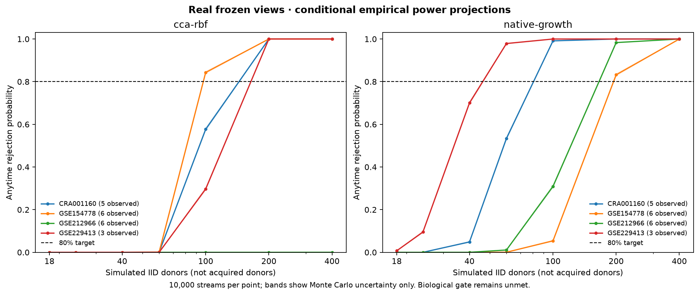

# Cellular power-gate work

The active requirement is at least **80% power at an audited usable donor budget**
for a useful, predeclared assay-specific alternative, with at least 10,000
independent null streams at alpha .05. It is not satisfied by reconstruction
loss, donor-matching AUROC, replaying the same donors as independent observations,
or selecting an easier synthetic scenario after inspecting results.

## Actual frozen-critic diagnostic

`scripts/evaluate_ecosystem_power.py` loads the real three-seed expansion's saved
donor summaries and critic checkpoints. It reconstructs training-only scaling,
fits no new encoder, and bounds scores with tanh. The scale grid is fixed and
selected by mean native-kernel log growth on same-study **training** donor pairs.
The bilinear baseline uses training donors only. All numerical scoring and
simulation run on CUDA under the canonical shared GPU lease.

Each held-out study is evaluated separately, avoiding pooled-study dependence as
an apparent success. The unchanged native statistic is
`h=(c(X1,Y1)+c(X2,Y2)-c(X1,Y2)-c(X2,Y1))/4`, with stake .9 and rejection threshold
20. Each stream samples IID draws from either the fixed empirical donor joint
distribution or the product of its marginals. Reported rejection frequencies,
Wilson intervals and detection delays retain all noncrossers.

These conditional empirical projections have only 3–6 observed donors per study.
They measure what the existing models imply, **not an audited biological power
certificate**. Increasing the simulated budget does not create additional real
donors. Results at 18 simulated donors are 0–0.24% rejection for the neural
critics; some critics have negative expected log growth on Zhang or Steele,
so adding donors alone cannot rescue them. The work must improve transferable
kernel growth as well as the available donor inventory.

```sh
PYTHONPATH=src python scripts/evaluate_ecosystem_power.py \
  --models data/interim/ecosystems/expansion/results-three-seed \
  --output data/interim/ecosystems/power/frozen-critics.json
```

The local report preserves all four critics, four held-out studies and budgets
18,24,40,60,100,200,400,800, each with 10,000 alternative and 10,000 null streams.
It explicitly sets `biological_gate_passed: false`. The original frozen critic
baseline remains available while more appropriate training is investigated.

## Training directly for native growth

The next real CUDA run compares 36 regularized CCA/RBF configurations and four
low-rank neural configurations. The neural loss is negative mean native-kernel
log growth, rather than matched-pair classification error. Critic hyperparameters
are selected using leave-one-training-study-out folds among 35 training donors.
The previously trained compartment encoders stay frozen; these are critic folds,
not fresh end-to-end encoder holdouts. Exactly one configuration per family is
written to `selection.json` before either is evaluated on the 20 development
holdout donors. The full candidate grid and weaker results remain visible.

The selected growth network has rank 2 and weight decay 1.0. Its measured log
growth on distinct donor pairs is positive in all four development holdouts,
improving the previous Zhang failure. However, its training-study validation
growth remains negative on Steele; transfer uncertainty has not disappeared.

| Development study | Observed donors | Native growth per distinct pair | Projected power at 60 donors | At 200 donors |
|---|---:|---:|---:|---:|
| Peng | 5 | 0.1265 | 53.39% | 100% |
| Lin | 6 | 0.0461 | 0.04% | 83.23% |
| Zhang | 6 | 0.0620 | 1.09% | 98.32% |
| Steele | 3 | 0.2553 | 97.88% | 100% |



The highest measured null rejection frequency is 4.31% across the original
frozen-critic diagnostic and 3.47% across the new selected-model diagnostic.
These checks support the simulation implementation; they do not eliminate
biological sampling/selection issues. A 200-donor projection is not a pass at
the available donor budget. Full results: [frozen critics](ecosystem-power/frozen-critics.json),
[growth training](ecosystem-power/growth-training.json), and
[all training-fold selections](ecosystem-power/selection.json).

```sh
PYTHONPATH=src python scripts/train_ecosystem_power.py \
  --models data/interim/ecosystems/expansion/results-three-seed \
  --output data/interim/ecosystems/power/growth-training
PYTHONPATH=src python scripts/plot_ecosystem_power.py \
  --report data/interim/ecosystems/power/growth-training/report.json \
  --output docs/ecosystem-power
```

## Additional source audit

[GSE291124](https://www.ncbi.nlm.nih.gov/geo/query/acc.cgi?acc=GSE291124) reports
17 treatment-naive primary PDAC donors profiled with single-nucleus RNA-seq.
Only source metadata have been inspected in this power work; count access,
identity overlaps, compartment coverage and assay transfer still need audit.
[GSE311788](https://www.ncbi.nlm.nih.gov/geo/query/acc.cgi?acc=GSE311788) describes
a broader 129-patient project but deposits only six scRNA samples. The broader
project's patient count cannot be used as 129 cellular donors. Related
GSE311783 has seven sample records, not an independent 129-donor cohort.

[GSE253429](https://www.ncbi.nlm.nih.gov/geo/query/acc.cgi?acc=GSE253429) reports
21 primary PDAC snRNA donors, of whom 17 are treatment-naive. The related
GSE278688/GSE278689 records describe 25 patients across scRNA/snRNA and tumor/
normal specimens; their 29 and eight sample records must not be summed as
37 independent tumor donors.

The newer [ctPANDA study](https://doi.org/10.1016/j.ccell.2026.05.012) points to
NODE OEP00006497. The public project API verifies 152 samples, 152 runs and
310 files (8.96 TB), but its data-security response is **Restricted**. This is
a verified candidate requiring approved access, not 152 available count datasets.
No restricted files were requested. The public website's download page lists a
prognostic gene list rather than original cell counts.

Reserved Hwang data remain unopened. The current result is a measured failure
diagnosis that determines the next training/data work; the requested gate remains
an active objective.
