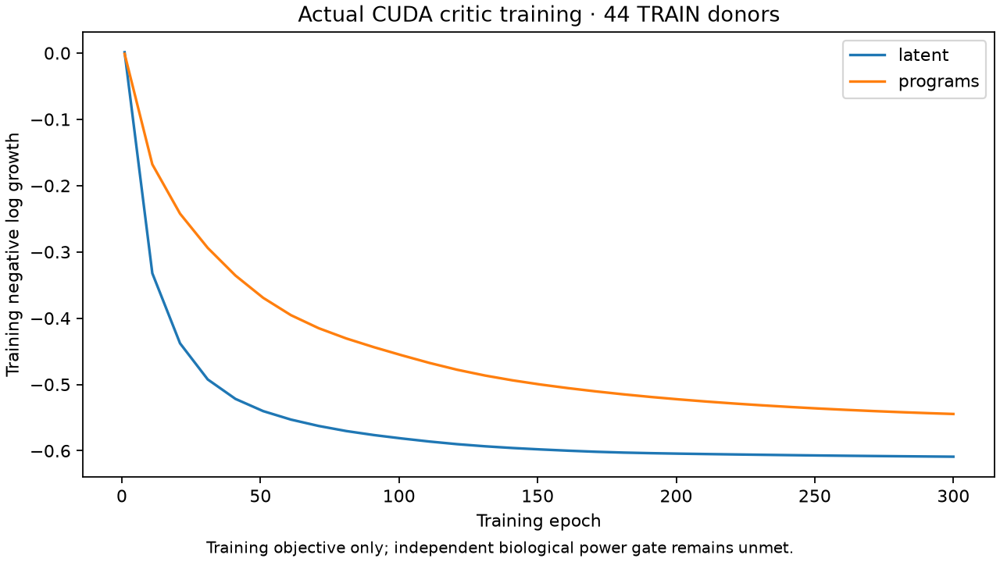
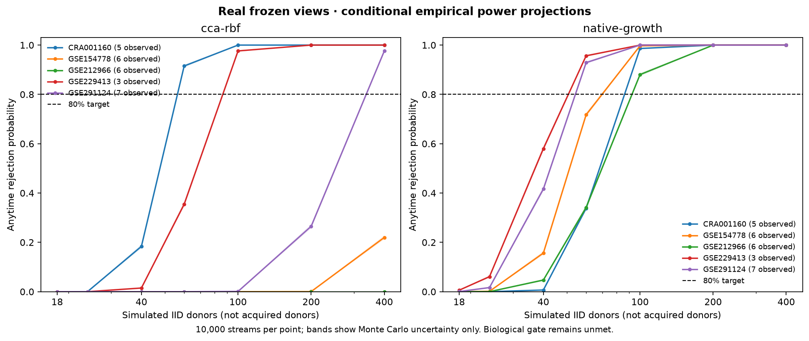

# Cellular snRNA donor expansion and GPU training

Added 17 original untreated primary-PDAC donors from [GSE291124](https://www.ncbi.nlm.nih.gov/geo/query/acc.cgi?acc=GSE291124), with 51 original count files (2,599,468,076 bytes), 272,766 prepared cells and all 2,625 frozen genes measured. Original donor numbers 1–9 were assigned TRAIN and 10–17 development-validation before opening counts. No missing gene was zero-imputed. These are development data, not private confirmation.

## Actual training results

CUDA transfer retained 221,323 cells after the existing 16,384-cell donor cap. Sixteen donors had both required compartments: nine training and seven validation. Combined with the previous source packs, there are 71 paired development donors: 44 TRAIN and 27 development-validation. These totals do not represent an available untreated private confirmation budget.

Both previous and new cohorts now use exactly 32 cells per donor and compartment, selected deterministically after sorting original cell IDs. Earlier all-cell-summary power projections in `ecosystem-power.md` are a different measurement and must not be substituted for these results.

The frozen denoising-autoencoder latent representation and the original predefined biological program gene representation were evaluated separately. Each view ran the same CUDA critic grid: 36 CCA/RBF configurations and four direct native-growth networks. Critic selection used mean leave-one-training-study-out log growth; selection was written before development scoring. The existing encoders remained frozen, so the folds validate critic selection, not an independently refitted encoder pipeline.

The latent network's actual negative-log-growth training loss decreased from 0.00122 to −0.60897 over 300 epochs. The program network finished at −0.54454. Negative values are expected because the objective is negative log evidence growth. They are not reconstruction MSE or proof of generalization.



| Development study | Paired donors | Latent growth per distinct donor pair | Program growth |
| --- | ---: | ---: | ---: |
| Peng / CRA001160 | 5 | 0.1145 | 0.1239 |
| Lin / GSE154778 | 6 | 0.1392 | −0.0890 |
| Zhang / GSE212966 | 6 | 0.1028 | 0.1257 |
| Steele / GSE229413 | 3 | 0.2353 | 0.0141 |
| New snRNA / GSE291124 | 7 | 0.1671 | 0.1017 |

The report's source IDs are authoritative; cohort display names above refer to the acquisition documentation. The program view had higher TRAIN cross-validation growth (0.0636 versus 0.0267) but failed on Lin. Choosing the latent view as the sole winning primary endpoint after seeing those development results would require a fresh independent evaluation.

## Power status: not passed

For the latent native critic, the new snRNA empirical-joint projection is 92.89% at 60 simulated donors. Across the five studies, 60-donor projections range from 33.83% to 95.66%; at 100 simulated donors they range from 88.03% to 100%. These simulations resample only 3–7 observed held-out donors per study. Their uncertainty bands describe Monte Carlo error, not uncertainty about the biological population. More simulated donors are not more acquired donors.



Every scenario uses 10,000 streams and the unchanged bounded native two-donor kernel, stake limit and threshold. Maximum observed product-null rejection over the evaluated budgets/studies was 3.64% for the latent native critic and 4.04% for the program native critic. This is a conditional product-null diagnostic, not completion of every confounding, dropout, rare-state and selection control in the plan. JSON reports include intervals, crossing delays and noncrossers.

Compartment transfer also needs improvement: 41.3% of loaded new cells were unassigned at the frozen 0.8 confidence threshold. Epithelial and fibroblast marker-top agreement was 75.4% and 90.1%. These checks do not independently establish malignancy; the epithelial compartment remains epithelial-enriched, not CNA-verified malignant. Frozen encoder validation MSE was 0.3267 epithelial and 0.3702 fibroblast, without a claim of superiority over PCA.

The remaining gate requires an independently justified usable donor budget and sufficient power for the frozen useful alternative at that budget. Hwang confirmation sources remain unopened. Public NODE metadata for the 152-patient ctPANDA source marks the available raw and related processed files Restricted; no restricted files were requested. GSE253429 is another possible development source, but its recurrence-based selection and treatment mapping need resolution before use.

## Reproduce

Acquire and prepare on the CPU using sparse count operations:

```bash
PYTHONPATH=src python scripts/prepare_ecosystem_snrna.py --root data/interim/ecosystems --acquire
PYTHONPATH=src python scripts/prepare_ecosystem_snrna.py --root data/interim/ecosystems
```

Run `scripts/evaluate_ecosystem_snrna.py --prepared <packs> --models <frozen-models> --output <output>` on CUDA separately for old and new packs. Use `ecosystem_snrna.combine_summaries` for disjoint old/new summaries, then `scripts/train_ecosystem_power.py` for each combined view. GPU workers acquire `/tmp/dnhacks-gpu.lock` for their complete lifetime; no CPU training fallback exists.

Artifacts: [latent report](ecosystem-snrna/latent/report.json), [program report](ecosystem-snrna/programs/report.json), [new transfer](ecosystem-snrna/snrna-transfer.json), [preparation](ecosystem-snrna/preparation.json). The reports contain the full curves, TRAIN selections, donor counts and conditional projections. Focused source identity, fixed-cell sampling, overlap, CUDA guard, power and native-kernel tests: 34 passed; two upstream SciPy deprecation warnings.
