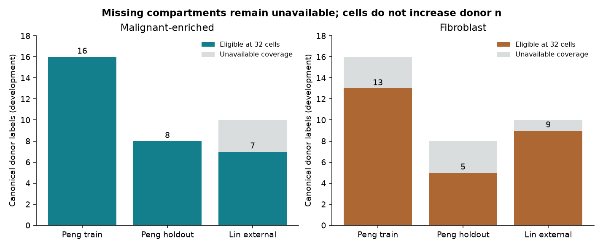
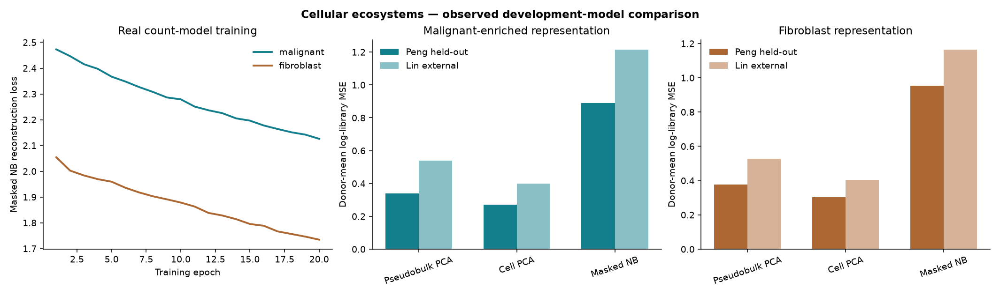

# Cellular ecosystem development: source audit and measured training

Original public Peng and Lin counts were downloaded and used to train and evaluate separate malignant-enriched and fibroblast representations on 2026-09-06. Cell PCA had the lowest held-out reconstruction error in both compartments. A 20-epoch masked negative-binomial pilot and a 20-epoch learned set pilot did not justify replacing the simpler representation. These are exposed development results; no biological confirmation or private cohort result is reported.

## Acquired sources and donor partitions

[The source inventory](ecosystem-sources.json) records every downloaded source URL, byte size and SHA256. Counts and trained weights remain local under `data/interim/ecosystems/`; the repository contains reproducible acquisition/preparation/training code and aggregate results. Public access was verified; no blanket redistribution license is inferred for original counts.

- **Peng / CRA001160:** original GSA `count-matrix.txt` (2,771,872,913 bytes) and `all_celltype.txt` (2,101,436 bytes), covering 57,530 cells. The source role manifest freezes T1–T16 as training and T17–T24 as donor-held-out development; N1–N11 controls are excluded. Canonical identities are `CRA001160:T#`, with GSA project, TISCH and Zenodo derivative aliases recorded rather than treated as replications. The original Results explicitly describes samples collected without treatment; this is publication-level attestation. Published type-2 ductal labels define a **malignant-enriched proxy**, without independent CNA verification. Published fibroblasts form the other compartment; stellate labels are excluded. [Original paper](https://pmc.ncbi.nlm.nih.gov/articles/PMC6796938/), [original count/annotation directory](https://download.cncb.ac.cn/gsa/CRA001160/).
- **Lin / GSE154778:** all 30 original 10x files for ten primary samples GSM4679532–GSM4679541 were downloaded, with GEO sample metadata and TISCH lineage annotations. P01–P10 are ten distinct primary patients in the original publication; the six metastatic biopsies are excluded. The entire cohort is external development and supplies no encoder training observations. Treatment status remains unresolved. TISCH malignant/fibroblast labels map explicitly to the development slots; this is an ontology bridge, not confirmation-approved label transfer. [Original paper](https://genomemedicine.biomedcentral.com/articles/10.1186/s13073-020-00776-9), [GEO](https://www.ncbi.nlm.nih.gov/geo/query/acc.cgi?acc=GSE154778), [annotation file](https://tisch.compbio.cn/static/data/PAAD_GSE154778/PAAD_GSE154778_CellMetainfo_table.tsv).

Peng recruitment at Peking Union Medical College Hospital and Lin recruitment at HonorHealth/Samsung support separation of these exposed development studies. The accession/specimen crosswalk prevents derivative and repeated sample aliases from increasing donor counts. It is not an independent confirmation identity certificate. Hwang GSE202051/GSE199102 and SCP1089/SCP1096 remain entirely reserved and unopened; no combined pancreatic atlas object was loaded. Elyada human data access was investigated: the paper directs human access through dbGaP on request; GSE129455 is mouse data and was not substituted for human observations. [Elyada paper](https://pmc.ncbi.nlm.nih.gov/articles/PMC6727976/).

## Frozen preparation and actual coverage

Both study role manifests precede numerical count acquisition. Peng counts are streamed in three passes: all-gene library totals, separate training-only gene/state references, then sparse selected panels. Each compartment has 2,000 genes. Feature metadata from the external Lin assays restricts selection to exact measured symbol intersections before fitting, with no external numerical selection or missing-gene imputation. Duplicate Lin gene symbols sum measured counts once. No full atlas or original dense count matrix is constructed.

Gene variance and frozen expression-program standardization use equal 32-cell subsamples per eligible training donor, seed 1701. The programs are specified in `ecosystem_data.PROGRAMS`: malignant stress, transport and antigen presentation; fibroblast contractile, inflammatory, antigen and metabolic descriptors. Their labels are argmax standardized expression summaries, not independently validated biological states. Library offsets use all measured genes, including genes outside the selected panel; NB v2 adds a residual decoder bin so those omitted counts do not inflate selected-gene rates.

| Compartment | Peng training cells / eligible donors | Peng held-out cells / eligible donors | Lin external cells / eligible donors |
| --- | ---: | ---: | ---: |
| Malignant-enriched | 6,341 / 16 of 16 | 4,974 / 8 of 8 | 3,125 / 7 of 10 |
| Fibroblast | 3,915 / 13 of 16 | 1,887 / 5 of 8 | 2,199 / 9 of 10 |

Cell counts are all prepared compartment cells; each model and evaluation uses 32 cells per eligible donor. Thus actual model fits use 512 malignant-enriched or 416 fibroblast cells. Complete two-compartment development coverage is only five Peng held-out and six Lin donors. Missing compartments remain unavailable rather than zero abundance; no repeated subsample adds donors.



## Real model comparison

Separate models were fitted with identical source panels, donor subsamples and seed. Cell PCA and NB use 32 latent dimensions. Donor pseudobulk PCA uses 15 malignant-enriched or 12 fibroblast dimensions, limited by training donors. The NB pilot uses masked-gene reconstruction, measured library offsets, learned dispersion and 20 epochs; it is not a claim of scVI equivalence.

| Compartment / method | Peng held-out log-library MSE | Lin external log-library MSE |
| --- | ---: | ---: |
| Malignant-enriched pseudobulk PCA | 0.3407 | 0.5396 |
| Malignant-enriched cell PCA | **0.2709** | **0.3986** |
| Malignant-enriched masked NB | 0.8886 | 1.2138 |
| Fibroblast pseudobulk PCA | 0.3759 | 0.5267 |
| Fibroblast cell PCA | **0.3026** | **0.4046** |
| Fibroblast masked NB | 0.9528 | 1.1632 |

Errors are equal-weight donor means on held-out cells, not independent-cell uncertainty estimates. The pseudobulk baseline is also projected back to cell expression for this common reconstruction diagnostic; its smaller rank and different objective are explicit. This comparison supports retaining cell PCA for this development use, not a universal model ranking. Selection uses the Peng donor holdout; Lin is a second, fully exposed transfer characterization and cannot later become confirmation.

A ridge readout fitted only on training embeddings measures fidelity to the fixed expression-program labels. For cell PCA, donor-mean accuracy is 0.6133/0.4643 for malignant-enriched Peng/Lin and 0.6750/0.6215 for fibroblast Peng/Lin; training-majority baselines are 0.4727/0.2723 and 0.4375/0.4410 respectively. Because labels derive from the same gene expression, these values measure descriptor preservation and cannot independently validate biological truth.



Every fit finished in seconds on CPU. [Aggregate model metrics](ecosystem-training/metrics.json) record exact timings, training losses, first-epoch projection, process peak RSS, execution versions, source/data/model hashes and held-out coverage. Runtime and artifact hashes include execution provenance and therefore need not be byte-identical across machines. The L40S was checked, but these pilots needed no GPU lease, GPU hours or larger training expansion. No transferable learned advantage was observed that would justify the proposed longer run.

## Learned set pilot and development demonstrations

A separate same-compartment, permutation-invariant 8-D tanh/mean pooling model was actually trained for 20 CPU epochs. Its objective reconstructs standardized donor mean/variance summaries plus a disjoint-subbag stability penalty. The comparator is 8-D PCA of training-only donor summaries, using the same references and cell budget.

| Compartment / exposed source | Learned set reconstruction MSE | Donor-summary PCA MSE |
| --- | ---: | ---: |
| Malignant-enriched / Peng | 0.6929 | **0.4749** |
| Malignant-enriched / Lin | 1.2905 | **1.0931** |
| Fibroblast / Peng | 1.0178 | **0.5752** |
| Fibroblast / Lin | 1.2338 | **0.8843** |

[Set metrics](ecosystem-training/set-metrics.json) include losses and subbag instability. The learned set model did not improve reconstruction, so default coupling retains frozen cell-embedding mean/variance and within-compartment state occupancy. Optional `profile --set-model` exposes experimental set embeddings with immutable model linkage. Neither training objective combines malignant and fibroblast inputs.

Real Peng and Lin donor profiles, within-study coupling maps and a cross-study malignant-enriched comparison were generated in the local model directory. They describe measured expression distributions only: no alanine flux, signaling direction, treatment causality, calibrated evidence or accepted discovery follows. Spatial-profile behavior has synthetic segmented-cell regression coverage; no real spatial cohort was acquired or represented as a spatial validation. Dissociated counts do not supply coordinates.

## Reproduce

```sh
uv sync --extra evalue --extra ecosystem --extra dev
PYTHONPATH=src uv run python scripts/build_ecosystem_data.py --root data/interim/ecosystems --source acquire
PYTHONPATH=src uv run python scripts/build_ecosystem_data.py --root data/interim/ecosystems --source peng
PYTHONPATH=src uv run python scripts/build_ecosystem_data.py --root data/interim/ecosystems --source lin
OPENBLAS_NUM_THREADS=2 OMP_NUM_THREADS=2 PYTHONPATH=src uv run python scripts/train_ecosystem_models.py --root data/interim/ecosystems --epochs 20
OPENBLAS_NUM_THREADS=2 OMP_NUM_THREADS=2 PYTHONPATH=src uv run python scripts/train_ecosystem_sets.py --root data/interim/ecosystems
uv run python scripts/plot_ecosystem_training.py --report docs/ecosystem-training/metrics.json --output /tmp/ecosystem-figures
```

The count download is approximately 2.8 GB plus compressed Lin files. The first command may install optional GPU-capable Torch even though CPU is used; source acquisition requires public network availability. Raw data, model weights and canonical donor records are not committed. [PDF training figure](ecosystem-training/ecosystem-training.pdf) and [PDF coverage figure](ecosystem-training/ecosystem-coverage.pdf) are standalone exports.

## Confirmation release decision

The existing 130-condition diagnostic uses 10,000 streams per condition and donor budgets 18, 24, 40, 60 and 100. Valid-null anytime rejection was 0–1.11%; the best tested 18-donor alternative reached only 0.67%, far below the predeclared 80% power target. Synthetic critic comparisons are not an assay-specific real-data power estimate. No confirmation design is released.

Before a sequestered pilot: independently audit eligible identities/population, establish untreated snRNA transfer and compartment selection, freeze a useful assay-specific alternative with adequate power, enforce private operator OS/service separation, and obtain the separately required pilot authorization. The implementation supplies tested receipt-only registration, immutable specifications, shared canonical-donor consumption and atomic frozen replay. It does not transform development inspection or an operator checkbox into scientific validity. Development acquisition and actual model training are complete; the remaining gates are explicit scientific/privacy release conditions.
