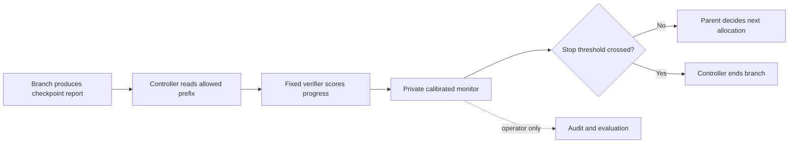

# E-valuator and the research tree

Assessment, 2026-09-05, with branch-level scope clarified against `fcf20648`. Proposal only: no monitor, training,
pruning changes or new biological tools were implemented in this review.

The subsequent [consolidated branch plan](../plans/PLAN-branch-monitoring.md) records the agreed
runtime direction: explicit checkpoints, mandatory agent reports after work pauses, parent-authorized
forks, full-subtree outcomes under a fixed total budget, and private human-review routing and plots.
It supersedes earlier per-action/child-fork and leaf-only endpoint recommendations; this document
remains the source-method assessment and statistical caveat record.

## Plain-language purpose

The current tree asks which sibling deserves more work. A trajectory monitor would additionally ask
whether a branch's progress looks sufficiently unlike successful past runs to stop spending on it.
For example, a branch investigating a pancreatic-cancer resistance mechanism might repeatedly fail
to obtain suitable data. A monitor could eventually stop it; a branch that carefully disproves the
mechanism should count as useful if that was its assigned task.

This is a proposed compute-allocation aid. Continuing a branch does not certify its science, and
stopping it does not prove that its hypothesis is false. The existing biological scoring service
answers a different question about experimental data and remains separate.

**The intervention is to stop an individual child branch.** Whole investigations are useful units
for grouping evaluation data, but that does not require stopping the entire investigation. Each child
has a private monitor, while its parent remains responsible for allocation among surviving children.
The predicted outcome concerns the subtree rooted at that child, including descendants' qualifying
findings by a fixed terminal budget. The reporting round is not that deadline. A fork is an action,
not success; verification plus a frozen relevance/evidence rubric defines the primary success label.

## Source and reading record

Read the full 27-page [E-valuator v2 paper](https://arxiv.org/html/2512.03109v2), including algorithms,
proofs, experiments and appendices. Sadhuka and colleagues include Genentech-affiliated authors.
The arXiv submission is dated 28 May 2026; the PDF title page says 29 May. A full PDF, page-marked
text extraction and provenance metadata are saved locally under `data/research/e-valuator/` in the
original checkout. That directory is ignored and untracked; it is not part of this documentation PR.
The [authors' implementation](https://github.com/shuvom-s/e-valuator) is available for a future pilot;
this review did not install, run or audit that package's numerical implementation.

The paper wraps a black-box verifier: training a new judge LLM is unnecessary. It fits small
classifiers to verifier-score histories, then separately calibrates a stopping threshold. The null
is eventual success; false alarms are stops on successful trajectories. Its fitted density ratios
are not automatically exact e-processes. PAC calibration handles estimation error under matching,
independent complete calibration trajectories. The authors use logistic regression, not GPU training
of a large model. These points come from Sections 2.2–2.5 and Appendix 8.3.1.

One paper typo matters for implementation: the last sentence of Appendix 8.1.2 reverses the
sample-size inequality. Follow Algorithm 1 and the preceding derivation. A finite threshold requires
`n >= ceil(log(delta) / log(1 - alpha))` successful threshold-calibration trajectories.
For `alpha=.045, delta=.005`, this is **116**. These are not steps or correlated sibling branches,
and this minimum supplies neither classifier-training data nor a guarantee of useful detection power.
The conditional FAR target is 4.5% with 99.5% calibration confidence; the paper's marginal bound is 5%.

## Existing code and proposed attachment points

| Existing component | Observed behavior | Proposed use |
| --- | --- | --- |
| `Explorer._act_fork` | Runs leaves for up to 18 steps, ranks siblings, keeps up to two, and resumes survivors in bounded rounds (96 total branch steps). | Collect complete fixed-budget subtree continuations; a leaf-only smoke test cannot validate this outcome target. Prevent monitored stops from being silently resumed. |
| `Explorer._judge_promise` | Produces relative `rank`, `keep`, `reason`; fallback favors submissions/experiments. | Retain as the allocation baseline. Its rank is not a probability of eventual success. Add a separate fixed prefix verifier if needed. |
| `Explorer.step` / `run` | Journals completed actions, then constructs the next agent message. | Add the agreed report/checkpoint lifecycle, with private monitoring at those checkpoints. Do not put monitor output in the observation. |
| `runtime.py` and `lineage.py` | Preserve ordered events, run/attempt identity and root ancestry. | Identify prefixes, action counts, costs and root-grouped evaluation splits. Store monitor scores separately from agent-readable events. |
| Branch continuation and SDK session persistence | One branch can resume across multiple `run()` calls. | Persist score history, monitor version and stopped status across attempts; never reset monitoring to obtain another chance. |

The six-entry rolling transcript alone is insufficient for the full history. Build each verifier input
from the recorded prefix available at that checkpoint, preserving tool failures and observations.
Do not let later evidence, final outcomes or current database state leak into a historical prefix.
Nested `fork` actions can already consume substantial child compute before the parent's action ends;
checking only the parent after a fork would save none of that work. A later recursive deployment needs
checkpoints inside children too, and explicit treatment of shared work and in-flight submissions.

## Branch-level pilot

An earlier review proposed whole-investigation stopping because it simplifies the calibration unit.
That does not answer the intended allocation question and is not the recommended intervention.
The pilot should record proposed stops for individual children while letting evaluation copies finish.
Use complete investigations to group related observations and quantify uncertainty, and address the
additional calibration assumptions explicitly instead of changing the stopping target.

For example, children A, B and C pursue different mechanisms. Each chosen child checkpoint extends
only that child's monitor history. A calibrated alarm on B makes B ineligible for further work; A and C
remain eligible under existing budget rules. A survivor resuming another round keeps its monitor history.
The parent never fills a beam quota by reviving a monitored stop. Existing evidence and queued scoring
jobs remain intact. Resource reallocation must be explicit in the controller and separately evaluated.
The pilot may record proposed stops before expansion while observing complete subtree outcomes.
An initial leaf-only plumbing test cannot validate this recursive target. Handling an ancestor alarm
while descendants are active is a later policy decision, not permission to cancel unrelated children
or discard their results. Human plots may show each episode's actual checkpoint history and latest
statistic, but must not splice descendants' statistics into a single e-value.

Use the following staged design:

1. **Define a narrow task and success rubric.** Use PDAC research tasks with independently checkable
   endpoints under a fixed tool/corpus/model/budget configuration. Examples include recovering a
   held-out documented mechanism with correctly attributed evidence or producing a reproducible
   analysis that passes independent checks. Score useful falsification explicitly. Merely submitting
   an experiment, sounding plausible or obtaining a large biological e-value is not the label.
   This benchmark measures its rubric, not future therapeutic success.
2. **Collect complete runs with monitoring disabled.** Use a fixed subtree sampling/allocation policy
   and terminal total budget shared by all descendants. Log one fixed verifier score per declared
   checkpoint and a separately assigned final label. Choose the horizon in a development pilot,
   then freeze it; each checkpoint predicts that same endpoint rather than refreshing the deadline.
   A frozen sampling rule can choose one eligible subtree per independent root; do not choose it
   after seeing success or monitor scores. Isolate mutable research memory and related tasks.
   Completed continuations without a qualifying outcome are unsuccessful within that budget;
   incomplete/interrupted traces are missing, and pending verification needs explicit adjudication.
   A rollout supplies multiple prefixes without rerunning from every checkpoint, but those prefixes
   and overlapping ancestor/descendant outcomes are not independent calibration trajectories.
3. **Separate fitting, threshold calibration and final testing.** Keep related tasks and all branches
   of one investigation together. Fit the classifier/score transformation on training roots, calibrate
   the alarm threshold on different roots, and reserve untouched test roots. Group splitting prevents
   leakage but does not turn siblings within a calibration partition into independent samples.
   Define a fixed behavior for untrained lengths, missing scores and verifier failures before calibration.
4. **Replay in observation-only mode.** Record when the monitor would stop while allowing the actual
   run to finish. This reveals successful runs it would have lost, unsuccessful runs caught and the
   remaining cost it could have saved. Never label a proposed stop as failure just because it was stopped.
5. **Test actual allocation only after the offline result is useful.** Compare a fixed validated monitor
   against current top-two selection, no early monitor, raw verifier thresholds, and PAC-calibrated raw
   verifier scores. For a subsequent tree trial use matched roots and equal total budgets, counting
   verifier calls and continued rejected branches used for evaluation. Reallocation can change results;
   replay alone cannot establish better final discoveries or realized wall-clock savings.

Suggested export fields are `root_id`, `run_id`, `episode_id`, `parent_id`, `checkpoint`, `prefix_hash`,
`verifier_score`, `monitor_statistic`, `final_label`, `label_provenance`, terminal/remaining budget,
model/prompt/policy/corpus/rubric versions, cumulative tokens and time.
The authors' package uses trajectory ID, step number, score and final `solved` label; our additional
root and provenance fields are needed to construct defensible splits before passing data to it.

## Why a tree needs additional work

**Success is conditional on an agreed continuation policy and budget.** An initial leaf that produces
no result in 18 steps might succeed with 96. Train for the horizon whose spending decision is being
made. Current selected continuations omit the outcomes of rejected siblings; collecting only winners
would bias the calibration population. Offline continuations need isolated state so their discoveries
do not alter the live comparison tree.

**Adaptive branches are not independent calibration examples.** Siblings inherit parent context and
selected descendants differ from initial leaves. Reusing a threshold trained on initial leaves at every
depth does not establish the same false-stop guarantee. Changing the model, corpus, verifier, feedback,
budget or allocation policy also changes the distribution. Version these together and validate the
deployment population; if the required calibration is missing, retain existing allocation without a
claim of statistical protection.

**A branch guarantee does not protect an entire investigation automatically.** A possible later
construction would define a complete, fixed-policy reference tree as the independent unit, then
calibrate a statistic over all successful branches' monitored prefixes within each reference tree.
This requires complete branch outcomes and a precise tree-level error event. It is an adaptation to
study, not a result proved or implemented here. Alternatively, error-budget allocation requires valid
bounds for each adaptively selected branch; assigning smaller alpha values alone does not supply them.
Never multiply arbitrary sibling scores or repeatedly spend the same error allowance on restarts.

**Unflagged does not mean good, and ranking can still discard good branches.** The monitor's false-stop
bound covers its own alarms, not losses from the existing beam-width rule. It supplies neither an
optimal search policy nor protection for rare novel mechanisms outside the calibration distribution.

**Preserve the existing private-scoring boundary.** Neither verifier inputs nor agent feedback should
include hidden biological e-values, scoring failures, or confirmation-only data. Keep monitor scores,
thresholds and alarm explanations out of tool stdout, recall, branch summaries and model prompts.
The controller can enact a stop without asking the agent to interpret a number. A visible allocation
decision can still reveal something; blinding means withholding scores and explanations, not claiming
zero information flow from an intervention. Same-user processes do not enforce filesystem isolation.

## Evidence to collect and figures to show

There are **no repo E-valuator training results or trajectory-monitoring evaluations yet**. Existing
expression wealth plots test biological two-sample evidence and cannot substantiate this proposal.

The first report should show: successful-trajectory false-stop rate with uncertainty; unsuccessful
trajectory detection and stopping step; net token cost including verifier overhead; and task success
under a matched total budget. Plot score paths with the frozen threshold, a false-stop versus budget
curve, and success versus total tokens. Use root-level evaluation uncertainty and separate calibration
from test curves. Count subgroups such as falsification tasks, novel mechanisms and different depths;
small subgroup samples do not establish subgroup guarantees. No synthetic illustrative plot should be
presented as a measured PDAC result.

Recommendation: collect complete bounded subtree traces and assess proposed child-branch stops
against qualifying descendant-inclusive outcomes, without changing live allocation. GPU availability is not
the limiting factor; reliable labels and representative independent runs are. Recursive branch stopping
is a later, separately validated policy change. Use the paper's strict `score > threshold` comparison;
at the 116-success minimum above, the threshold is the largest successful calibration maximum.
